### Hi 👋, I'm Funmilayo (Bajomo Oluwafunmilayo Esther)

**Aspiring DevOps Engineer | Computer Science Graduate**

- 🌍 I'm based in Lagos, Nigeria
- 💻 Currently learning Cloud Computing, Linux, CI/CD and automation tools
- 🚀 Passionate about infrastructure, systems reliability and DevOps practices
- 🧠 Background in IT Support, Data Entry and basic web development (HTML, CSS, JavaScript)
- 🤝 Open to collaborating on beginner-friendly DevOps, cloud and automation projects
- ⚡ Fun fact: I enjoy understanding how systems connect and run efficiently
- ✉️ Reach me at **bajomoF@gmail.com**

---

### 🛠️ Skills & Technologies

**Currently Learning:**  
Docker • GitHub Actions • Cloud Computing (AWS/Azure basics) • CI/CD Concepts • Bash

---

### 📂 Featured Project

**Personal GitHub Portfolio**  
- Hosted a simple HTML/CSS project to practice version control  
- Practiced branching, merging and pull request workflows  

🔗 [View on GitHub](https://github.com/goodCake21)

---

### 📊 GitHub Stats

![Funmilayo's GitHub stats]

### 📫 Connect with me

---

⭐️ From [goodCake21](https://github.com/goodCake21)
